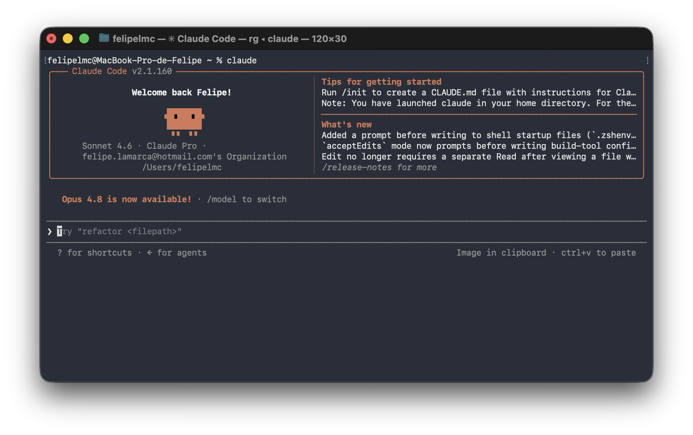
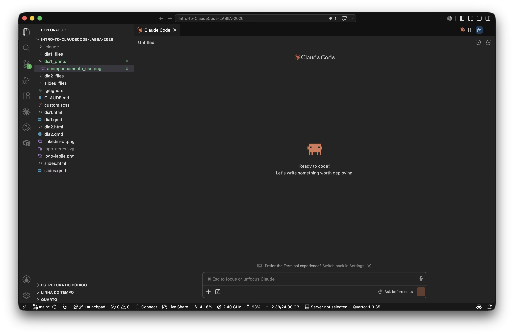
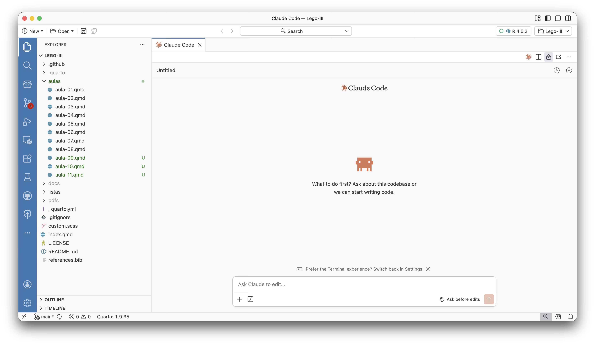
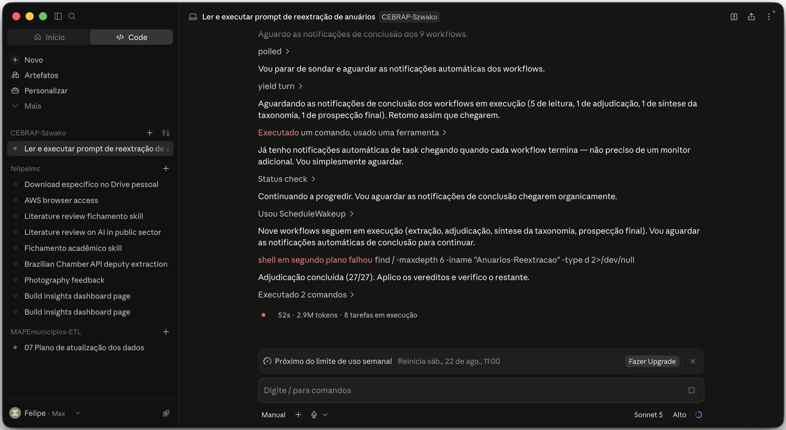
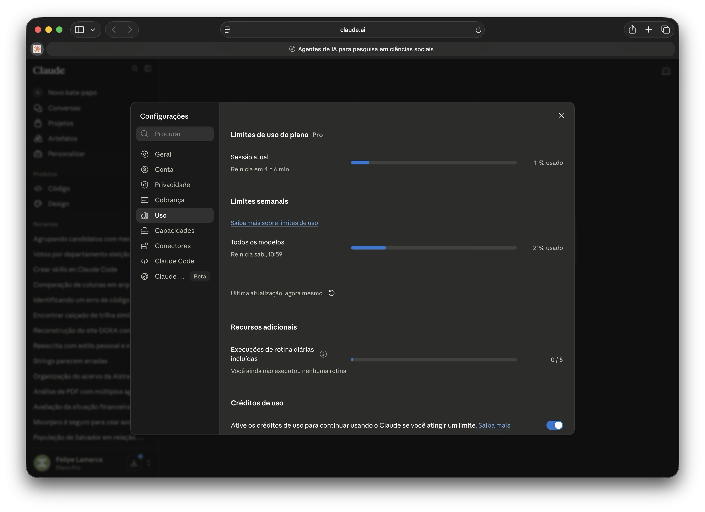
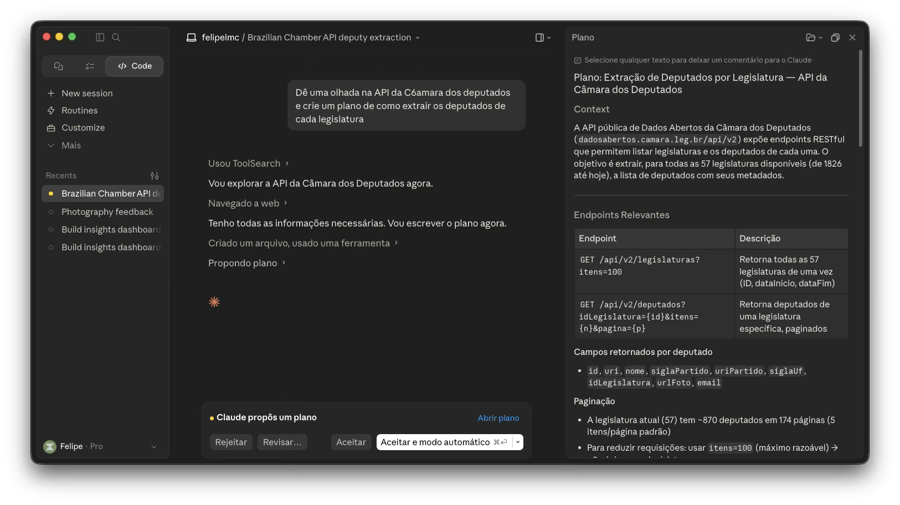

## {background-color="#1e293b"}

<br>

[01]{.agenda-num} &nbsp; **Do chat ao agente:** o que muda na prática

<br>

[02]{.agenda-num} &nbsp; **Claude Code na prática:** instalação, CLAUDE.md e skills

<br>

[03]{.agenda-num} &nbsp; **Gerenciamento de contexto**

<br>

[04]{.agenda-num} &nbsp; **Aplicações práticas:** demos ao vivo

<br>

[05]{.agenda-num} &nbsp; **Para além do curso:** limites, ética e recursos

---

# Do chat ao agente {background-color="#2563eb"}

---

## Você provavelmente já usa IA 💬

- Interface de chat: você digita, o modelo responde
- Cada conversa começa do zero: sem memória de sessões anteriores, sem acesso ao seu ambiente de trabalho
- Interações **transacionais**: úteis para tarefas pontuais, mas sem continuidade

---

## O chat tem limites para pesquisa

- Sem acesso ao seu ambiente de trabalho (arquivos, código, terminal)
- Sem memória entre sessões
- Cada etapa do ciclo de pesquisa (coleta, análise, documentação, comunicação) exige sua coordenação manual

---

## O que é um agente de IA? 🤖

> O agente decide o próximo passo, roda o código e corrige sozinho quando dá erro. Você entra só pra revisar.

<br>

| Chat | Agente |
|------|--------|
| Responde | Age |
| Uma troca | Múltiplas etapas |
| Você executa | Ele executa |

---

## Anatomia de um agente 🔬

```{mermaid}
%%| fig-width: 9
flowchart LR
  H(["👤  Pesquisador"]) -->|instrução| L(["🧠  LLM"])
  M(["💾  Memória"]) <--> L
  L --> T(["🛠️  Ferramentas"])
  T -->|executa| E(["🌍  Ambiente"])
  E -->|"resultado / erro"| L

  style H fill:#475569,color:white,stroke:none
  style L fill:#2563eb,color:white,stroke:none
  style M fill:#1e293b,color:#94a3b8,stroke:#475569
  style T fill:#1e293b,color:#94a3b8,stroke:#475569
  style E fill:#475569,color:white,stroke:none
  linkStyle default stroke:#64748b,stroke-width:2px
```

<div style="display:flex; justify-content:center; gap:2.5em; font-size:0.52em; color:#64748b; margin-top:0.4em;">
<span>💾 contexto da sessão + CLAUDE.md</span>
<span>🛠️ terminal · arquivos · APIs · web</span>
</div>

---

## Claude Code 🖥️

- CLI que roda no terminal, ou integrado ao VSCode e ao Positron
- Lê e escreve arquivos, executa código, acessa o `git` e o shell
- É, hoje, o agente de IA mais maduro para uso em pesquisa

. . .

> Roda o script, encontra o erro, corrige e re-executa. Você nem chega a abrir o terminal.

---

## Outros agentes de IA 🌐

| Ferramenta | Empresa | Diferencial |
|---|---|---|
| **Claude Code** | Anthropic | CLI + IDE; forte em raciocínio e texto |
| **Codex** | OpenAI | Equivalente da OpenAI para terminal |
| **Cursor** | Cursor AI | IDE própria centrada em IA |
| **Cline** | Open-source | Extensão VSCode; suporta vários modelos |

. . .

A escolha depende do modelo que você prefere e de como trabalha. **O raciocínio de hoje vale pra qualquer uma delas**

---

# Claude Code na prática {background-color="#2563eb"}

---

## Instalação 💻

Baixar o app em **claude.com/download**, disponível para Mac e Windows

. . .

Depois, abrir o Claude e pedir:

> *"Me ajude a instalar o Claude Code no meu computador"*

. . .

O próprio Claude guia a instalação: detecta o sistema operacional e resolve as dependências sozinho

---

## Integrações no dia a dia 🖥️

<div style="display:grid; grid-template-columns:1fr 1fr; gap:0.5em; margin-top:0.3em;">

<div style="background:#f1f5f9; border-radius:10px; padding:0.65em; font-size:0.52em;">
<div style="font-weight:600; color:#1e293b; margin-bottom:0.5em;">💻 Terminal</div>

<div style="color:#475569; margin-top:0.5em;"><code>cd projeto/ &amp;&amp; claude</code></div>
</div>

<div style="background:#f1f5f9; border-radius:10px; padding:0.65em; font-size:0.52em;">
<div style="font-weight:600; color:#1e293b; margin-bottom:0.5em;">🟦 VSCode</div>

<div style="color:#475569; margin-top:0.5em;">Extensão "Claude Code" na barra lateral</div>
</div>

<div style="background:#f1f5f9; border-radius:10px; padding:0.65em; font-size:0.52em;">
<div style="font-weight:600; color:#1e293b; margin-bottom:0.5em;">🟣 Positron</div>

<div style="color:#475569; margin-top:0.5em;">Para quem usa R: mesmo mecanismo</div>
</div>

<div style="background:#f1f5f9; border-radius:10px; padding:0.65em; font-size:0.52em;">
<div style="font-weight:600; color:#1e293b; margin-bottom:0.5em;">📱 App desktop</div>

<div style="color:#475569; margin-top:0.5em;">Aba "Code": sessões organizadas por projeto</div>
</div>

</div>

---

## Quanto custa? 💰

| Plano | Preço | Para quem |
|---|---|---|
| **Pro** | US$ 20/mês | Uso individual |
| **Max 5×** | US$ 100/mês | Uso intensivo |
| **Max 20×** | US$ 200/mês | Uso muito intensivo |
| **API** | Por token | Automação e uso programático |
| **Team / Enterprise** | A partir de US$ 30/usuário | Organizações |

. . .

O plano Pro tem limite de uso, mas dá pra render bem numa rotina de pesquisa acadêmica

---

## Acompanhando o gasto 📊



. . .

No dashboard da Anthropic, em tempo real: uso de tokens e gasto por período, com alerta quando bate o limite

---

## CLAUDE.md: instruções persistentes 📋

Arquivo de instruções persistentes, lido automaticamente pelo agente a cada nova sessão

<br>

O que colocar:

- Contexto do projeto e objetivos
- Convenções técnicas (linguagem, estrutura de pastas)
- **Decisões analíticas já tomadas**, e por quê

. . .

É a **memória permanente** do agente no projeto: o que sobrevive ao `/clear`

---

## Um CLAUDE.md para pesquisa

```markdown
# CLAUDE.md

## Contexto
Projeto de monitoramento de votações nominais na Câmara dos Deputados.
Fonte: API de Dados Abertos da Câmara -- não usar scraping do site.

## Convenções
- Usar R 4.3+ com tidyverse e ggplot2
- Salvar gráficos em `output/figures/`
- Cada análise em script separado

## Decisões analíticas
- Unidade de análise: deputado × votação nominal
- Hipótese: alinhamento ao governo varia por bloco partidário
- Considerar só a legislatura atual (57ª)
- Excluir votações simbólicas (sem registro nominal)
```

---

## A pasta `.claude` 📁

```
projeto/
├── CLAUDE.md              ← instruções permanentes do projeto
└── .claude/
    ├── commands/          ← suas skills customizadas
    │   ├── voice.md
    │   └── summarize.md
    └── settings.json      ← permissões e configurações
```

. . .

E na sua máquina, fora de qualquer projeto:

```
~/.claude/
└── commands/              ← skills globais, disponíveis em todo projeto
    └── voice.md
```

---

## Skills: comandos customizados ⚡

`/nome-da-skill` executa um *prompt* reutilizável, definido num arquivo `.md` em `.claude/commands/`

```markdown
Você vai receber um texto acadêmico em português.
Produza um resumo estruturado com:
1. Pergunta de pesquisa (1 frase)
2. Método principal (1 frase)
3. Resultado central (2 frases)
4. Limitações reconhecidas pelos autores (bullet points)
```

. . .

Para usar: chame `/summarize` e cole o abstract ou o artigo inteiro. É portátil entre projetos: copie a pasta e as skills vão junto

---

## Skills de pesquisa 🔬

| Skill | O que faz |
|---|---|
| `/voice` | Reescreve texto no seu estilo de escrita |
| `/summarize` | Resume artigos: pergunta, método, achado, limites |
| `/referee-2` | Revisão em instância nova do terminal: "não peça ao mesmo Claude que escreveu o código para revisá-lo" |
| `/blindspot` | Identifica análises que você não pensou em fazer |

. . .

`/referee-2` e `/blindspot` são do workflow de Scott Cunningham (`github.com/scunning1975/MixtapeTools`)

---

## Plan mode: revise antes de executar 🛡️

Antes de qualquer tarefa não-trivial: entrar em **plan mode** com `Shift+Tab`



. . .

O agente mostra o plano antes de tocar em qualquer arquivo. Você aprova, ajusta ou cancela

---

## {background-color="#0f172a"}

::: {.r-fit-text}
Gerenciamento
de contexto
:::

---

## A janela de contexto 🧠

Tudo que o modelo "vê" ao mesmo tempo cresce a cada iteração

<div style="display:flex; gap:1.4em; align-items:flex-start; justify-content:center; font-size:0.4em; margin-top:0.8em;">

<div style="flex:1; max-width:200px;">
<div style="color:#64748b; text-align:center; margin-bottom:0.6em; font-family:sans-serif;">Início</div>
<div style="display:flex; flex-direction:column; gap:0.5em;">
  <div style="background:#2563eb; color:white; border-radius:14px 14px 4px 14px; padding:0.55em 0.9em; font-family:sans-serif;">🗨️ carregue e explore os dados</div>
  <div style="background:#1e293b; color:#94a3b8; border-radius:4px 14px 14px 14px; padding:0.55em 0.9em; font-family:monospace;">🤖 aqui está o código</div>
</div>
<div style="background:#e2e8f0; border-radius:999px; height:0.5em; margin-top:0.8em; overflow:hidden;">
  <div style="background:#2563eb; width:15%; height:100%;"></div>
</div>
<div style="text-align:center; color:#64748b; margin-top:0.3em; font-family:sans-serif;">~15% da janela</div>
</div>

<div style="color:#475569; font-size:1.8em; padding-top:2.2em;">→</div>

<div style="flex:1; max-width:200px;">
<div style="color:#64748b; text-align:center; margin-bottom:0.6em; font-family:sans-serif;">Algumas trocas depois</div>
<div style="display:flex; flex-direction:column; gap:0.5em;">
  <div style="background:#2563eb; color:white; border-radius:14px 14px 4px 14px; padding:0.55em 0.9em; font-family:sans-serif;">🗨️ carregue e explore os dados</div>
  <div style="background:#1e293b; color:#94a3b8; border-radius:4px 14px 14px 14px; padding:0.55em 0.9em; font-family:monospace;">🤖 aqui está o código</div>
  <div style="background:#0f172a; color:#64748b; border-radius:6px; padding:0.45em 0.9em; font-family:monospace;">💻 erro na linha 12</div>
  <div style="background:#2563eb; color:white; border-radius:14px 14px 4px 14px; padding:0.55em 0.9em; font-family:sans-serif;">🗨️ corrija o erro</div>
  <div style="background:#1e293b; color:#94a3b8; border-radius:4px 14px 14px 14px; padding:0.55em 0.9em; font-family:monospace;">🤖 [versão corrigida]</div>
  <div style="background:#0f172a; color:#64748b; border-radius:6px; padding:0.45em 0.9em; font-family:monospace;">📄 dados.csv</div>
</div>
<div style="background:#e2e8f0; border-radius:999px; height:0.5em; margin-top:0.8em; overflow:hidden;">
  <div style="background:#f59e0b; width:55%; height:100%;"></div>
</div>
<div style="text-align:center; color:#64748b; margin-top:0.3em; font-family:sans-serif;">~55% da janela</div>
</div>

<div style="color:#475569; font-size:1.8em; padding-top:2.2em;">→</div>

<div style="flex:1; max-width:200px;">
<div style="color:#f87171; text-align:center; margin-bottom:0.6em; font-family:sans-serif;">Muitas iterações depois</div>
<div style="display:flex; flex-direction:column; gap:0.5em;">
  <div style="background:#2563eb; color:white; border-radius:14px 14px 4px 14px; padding:0.55em 0.9em; font-family:sans-serif;">🗨️ carregue e explore os dados</div>
  <div style="background:#1e293b; color:#94a3b8; border-radius:4px 14px 14px 14px; padding:0.55em 0.9em; font-family:monospace;">🤖 aqui está o código</div>
  <div style="background:#0f172a; color:#64748b; border-radius:6px; padding:0.45em 0.9em; font-family:monospace;">💻 erro na linha 12</div>
  <div style="background:#2563eb; color:white; border-radius:14px 14px 4px 14px; padding:0.55em 0.9em; font-family:sans-serif;">🗨️ corrija o erro</div>
  <div style="background:#1e293b; color:#94a3b8; border-radius:4px 14px 14px 14px; padding:0.55em 0.9em; font-family:monospace;">🤖 [versão corrigida]</div>
  <div style="background:#7f1d1d; color:#fca5a5; border-radius:6px; padding:0.45em 0.9em; font-family:monospace; font-weight:bold;">⚠️ LIMITE DA JANELA</div>
</div>
<div style="background:#e2e8f0; border-radius:999px; height:0.5em; margin-top:0.8em; overflow:hidden;">
  <div style="background:#dc2626; width:95%; height:100%;"></div>
</div>
<div style="text-align:center; color:#dc2626; margin-top:0.3em; font-family:sans-serif; font-weight:bold;">~95% da janela</div>
</div>

</div>

---

## Estratégias de gerenciamento 🎯

| Estratégia | O que faz |
|---|---|
| `/clear` | Reinicia a sessão, preserva o CLAUDE.md |
| Compaction automática | O Claude resume o contexto sozinho quando necessário |
| Sessões focadas | Uma tarefa por sessão |
| **CLAUDE.md** | Memória que sobrevive ao `/clear` |

. . .

> Tarefas grandes = múltiplas sessões pequenas e focadas

---

# Aplicações práticas {background-color="#2563eb"}

---

## As demos de hoje

<div style="display:flex; gap:1em; margin-top:0.8em;">

<div style="flex:1; background:#1e293b; border-radius:12px; padding:1.1em; text-align:center;">
<div style="font-size:1.8em; margin-bottom:0.3em;">🌳</div>
<div style="color:white; font-weight:600; font-size:0.68em;">Pesquisa em paralelo</div>
<div style="color:#94a3b8; font-size:0.55em; margin-top:0.3em;">Bancada ambientalista: literatura e votações no Congresso</div>
</div>

<div style="flex:1; background:#1e293b; border-radius:12px; padding:1.1em; text-align:center;">
<div style="font-size:1.8em; margin-bottom:0.3em;">🌐</div>
<div style="color:white; font-weight:600; font-size:0.68em;">Site pessoal</div>
<div style="color:#94a3b8; font-size:0.55em; margin-top:0.3em;">Do currículo ao deploy</div>
</div>

</div>

---

## Demo: bancada ambientalista, literatura e dados {background-color="#2563eb"}

---

## O problema

Revisão de literatura e coleta de dados legislativos normalmente rodam em processos separados -- primeiro se lê, depois, semanas depois, se coleta

. . .

Hoje as duas rodam sobre o mesmo tema: como a bancada ambientalista vota no Congresso

---

## O pipeline

```{mermaid}
%%| fig-width: 9
flowchart LR
  A(["🔍  OpenAlex<br/>literatura sobre voto ambiental"]) --> C(["✍️  Fichamentos<br/>Claude Code"])
  B(["🏛️  Câmara API<br/>votações ambientais"]) --> D(["📊  Análise exploratória<br/>Claude Code"])

  style A fill:#475569,color:white,stroke:none
  style B fill:#475569,color:white,stroke:none
  style C fill:#2563eb,color:white,stroke:none
  style D fill:#2563eb,color:white,stroke:none
  linkStyle default stroke:#64748b,stroke-width:2px
```

---

## Buscando a literatura

A **OpenAlex** indexa ~250 milhões de trabalhos acadêmicos com API gratuita e sem autenticação

```python
import requests

params = {
    "search": "bancada ambientalista Congresso Nacional votação",
    "filter": "publication_year:2015-2025",
    "sort": "cited_by_count:desc",
    "per_page": 25
}
resp = requests.get("https://api.openalex.org/works", params=params)
works = resp.json()["results"]
```

. . .

Claude Code lê os abstracts retornados e gera um fichamento estruturado de cada um

---

## APIs de dados abertos no Brasil 🇧🇷

| API | O que oferece |
|---|---|
| **Câmara dos Deputados** | Deputados, votações, proposições, despesas |
| **Portal da Transparência** | Gastos do governo federal, contratos, servidores |
| **IBGE** | PNAD, censo, indicadores socioeconômicos |
| **TSE** | Resultados eleitorais, candidatos, financiamento |

---

## A API da Câmara dos Deputados

Base URL: `dadosabertos.camara.leg.br/api/v2`

```r
library(httr2)
library(purrr)

deputados <- request("https://dadosabertos.camara.leg.br/api/v2/deputados") |>
  req_url_query(idLegislatura = 57, ordem = "ASC", ordenarPor = "nome") |>
  req_perform() |>
  resp_body_json(simplifyVector = TRUE) |>
  pluck("dados")
```

. . .

Retorna JSON. Com `simplifyVector = TRUE`, o `httr2` já entrega um data frame pronto

---

## Achando as votações ambientais

Proposições têm um código de tema -- meio ambiente é `codTema = 48`, e a lista completa está em `/referencias/proposicoes/codTema`

```r
proposicoes <- request("https://dadosabertos.camara.leg.br/api/v2/proposicoes") |>
  req_url_query(codTema = 48, itens = 100) |>
  req_perform() |> resp_body_json(simplifyVector = TRUE) |> pluck("dados")

# ex.: PL 2159/2021, a Lei do Licenciamento Ambiental (id 257161)
votacoes <- request("https://dadosabertos.camara.leg.br/api/v2/proposicoes/257161/votacoes") |>
  req_perform() |> resp_body_json(simplifyVector = TRUE) |> pluck("dados")
```

. . .

Cada proposição pode ter várias votações -- de emendas, destaques, do texto principal. Escolher qual votação usar é decisão da pesquisa, não do código

---

## Endpoints úteis

| Endpoint | Traz |
|---|---|
| `/proposicoes?codTema=48` | Proposições sobre meio ambiente |
| `/proposicoes/{id}/votacoes` | Votações de uma proposição específica |
| `/votacoes/{id}/votos` | Como cada deputado votou |
| `/deputados` | Partido, estado, foto |

---

## Duas saídas, mesmo tema

- Da literatura: fichamentos estruturados, um por trabalho, salvos em `/fichamentos/`
- Dos dados: um pedido direto -- "faça uma análise exploratória dessas votações" -- que vira um relatório simples de pesquisa: quem votou o quê, por partido e por estado

. . .

> Não é redação automática de um paper. O Claude Code ajuda a explorar os dados; o que vira achado é decisão sua

---

## Demo: site pessoal a partir do currículo {background-color="#2563eb"}

---

## Do currículo ao site pessoal 🌐

:::: {.columns}

::: {.column width="48%"}
**Input**

- Currículo em texto simples ou PDF
- Uma instrução ao agente
:::

::: {.column width="48%"}
**Output**

- Página HTML/CSS completa e responsiva
- Publicável no GitHub Pages sem configuração manual
:::

::::

. . .

<br>

O mesmo raciocínio vale para páginas de projeto: o gap entre ter um artigo com código e ter uma página sobre ele é menor do que parece

---

# Para além do curso {background-color="#2563eb"}

---

## Problemas parcialmente contornáveis 🔧

| Problema | Mitigação |
|---|---|
| Erros e alucinações | Revisão sistemática; agentes paralelos para verificação cruzada |
| Degradação do contexto | Sessões focadas por tarefa; compactação automática |
| Deriva de escopo | CLAUDE.md com restrições analíticas explícitas |
| Reprodutibilidade | Documentar decisões, não apenas o código gerado |

---

## O que não delegar ⚠️

- A **interpretação substantiva** dos achados é do pesquisador
- As **decisões de design**: o que medir, como operacionalizar, quais hipóteses testar
- A **validação**: o agente sabe se o código roda; você verifica se o achado faz sentido
- A **responsabilidade autoral**: o pesquisador assina, inclusive pelo que o agente produziu

. . .

> O Claude Code acelera a parte mecânica da pesquisa. O raciocínio científico continua sendo seu trabalho

---

## O que dizem os periódicos 📚

:::: {.columns}

::: {.column width="48%"}
**Internacionais**

Padrão dominante: disclosure obrigatório + IA não pode ser autora

- [AJPS](https://ajps.org/ajps-ai-policy/): proíbe usar IA para redigir o manuscrito
- [APSR](https://www.cambridge.org/core/journals/american-political-science-review/information/author-instructions/preparing-your-materials): exige disclosure
- [Journal of Politics](https://www.journals.uchicago.edu/journals/jop/instruct): proíbe uso na redação
- [Political Analysis](https://www.cambridge.org/core/journals/political-analysis/information/author-instructions/preparing-your-materials): disclosure com ferramenta, versão e uso
:::

::: {.column width="48%"}
**Brasileiros**

- [CNPq -- Portaria nº 2.664/2026](https://www.gov.br/cnpq/pt-br/assuntos/noticias/cnpq-em-acao/cnpq-publica-portaria-que-institui-politica-de-integridade-na-atividade-cientifica): disclosure obrigatório em todas as fases; pesquisador é integralmente responsável
- [Opinião Pública / Unicamp](https://periodicos.sbu.unicamp.br/ojs/index.php/index/diretrizes): nota de rodapé com ferramentas, fases e seções
:::

::::

---

## Recursos úteis 📖

Workflows de pesquisadores que valem a visita. Os repositórios são públicos:

<br>

**Scott Cunningham**
`github.com/scunning1975/MixtapeTools`

**Manoel Galdino**
`github.com/mgaldino/agents-workflow`

**Pedro Sant'Anna**
`github.com/pedrohcgs/claude-code-my-workflow`

. . .

> A pasta `.claude` deles é pública: dá pra copiar, adaptar e construir em cima

---

## Obrigado! {background-color="#1e293b"}

<div style="text-align:center; margin-top:1.2em;">

<div style="font-size:1.2em; font-weight:700; color:white; margin-bottom:0.25em;">Felipe Lamarca</div>
<div style="font-size:0.62em; color:#64748b; margin-bottom:1.4em; letter-spacing:0.02em;">IESP-UERJ · MAPE · DOXA · NECON</div>

<div style="font-size:0.65em; color:#94a3b8; line-height:2.4;">
📧 &nbsp;felipe.lamarca@hotmail.com<br>
🌐 &nbsp;felipelamarca.com
</div>

<div style="font-size:0.5em; color:#475569; margin-top:1.8em;">
📂 &nbsp;github.com/felipelmc/Presentations/tree/main/AgentesIA-FMMAPE-2026
</div>

</div>
