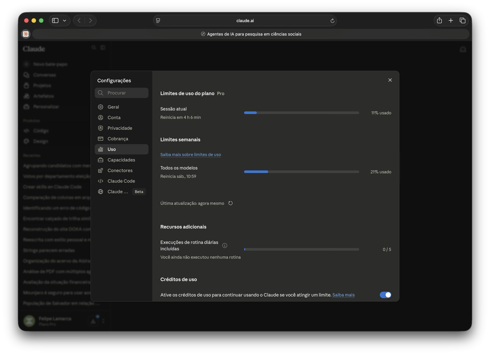
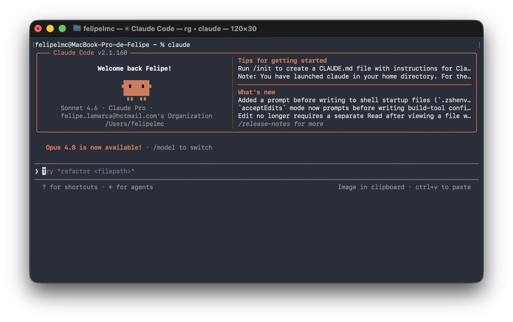
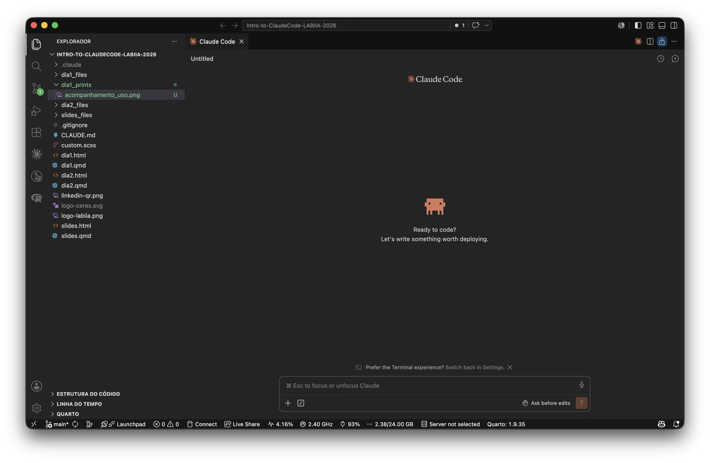
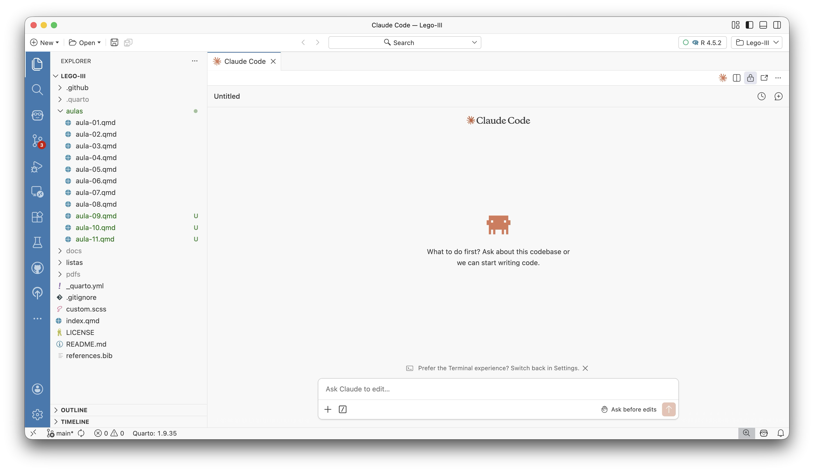
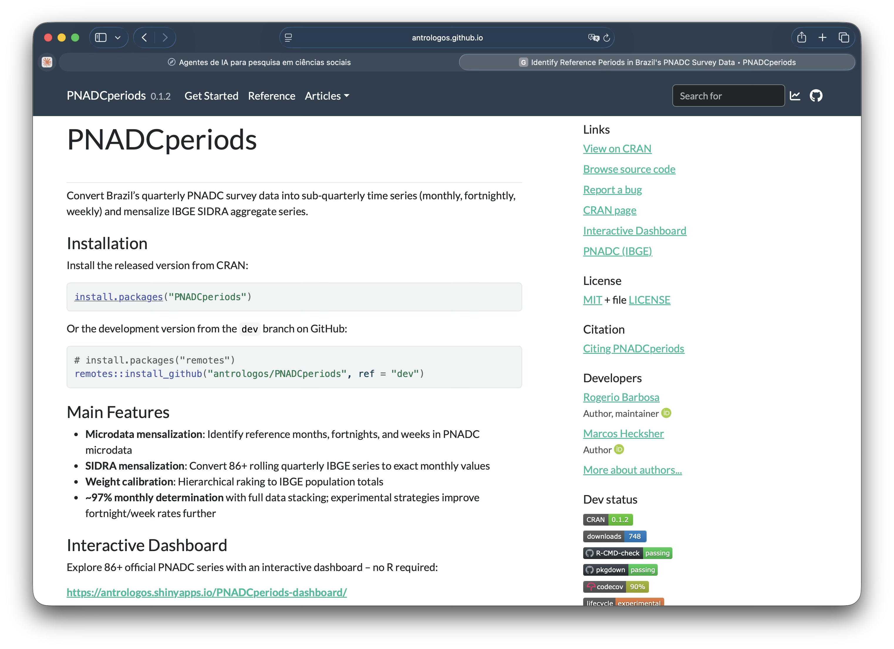

## {background-color="#1e293b"}

<br>

[01]{.agenda-num} &nbsp; **Chats e agentes**

<br>

[02]{.agenda-num} &nbsp; **Instalação:** Mac e Windows

<br>

[03]{.agenda-num} &nbsp; **Integrações:** VSCode, Positron e terminal

<br>

[04]{.agenda-num} &nbsp; **Configurando o ambiente:** `.claude`, CLAUDE.md, skills e rules

<br>

[05]{.agenda-num} &nbsp; **Sites de projeto e sites pessoais**

---

# Chats e agentes {background-color="#2563eb"}

---

## Você provavelmente já usa IA 💬

- Interface de chat: você digita, o modelo responde
- Cada conversa começa do zero: sem memória de sessões anteriores, sem acesso ao seu ambiente de trabalho
- Interações **transacionais**: úteis para tarefas pontuais, mas sem continuidade

---

## O chat tem limites para pesquisa

- Sem acesso ao seu ambiente de trabalho (arquivos, código, terminal)
- Sem memória entre sessões
- Cada etapa do ciclo de pesquisa — coleta, análise, documentação, comunicação — exige sua coordenação manual

---

## O que é um agente de IA? 🤖

> Em vez de responder a perguntas pontuais, o agente planeja ações, executa código e itera sobre tarefas complexas com supervisão mínima.

<br>

| Chat | Agente |
|------|--------|
| Responde | Age |
| Uma troca | Múltiplas etapas |
| Você executa | Ele executa |

---

## Anatomia de um agente 🔬

```{mermaid}
%%| fig-width: 9
flowchart LR
  H(["👤  Pesquisador"]) -->|instrução| L(["🧠  LLM"])
  M(["💾  Memória"]) <--> L
  L --> T(["🛠️  Ferramentas"])
  T -->|executa| E(["🌍  Ambiente"])
  E -->|"resultado / erro"| L

  style H fill:#475569,color:white,stroke:none
  style L fill:#2563eb,color:white,stroke:none
  style M fill:#1e293b,color:#94a3b8,stroke:#475569
  style T fill:#1e293b,color:#94a3b8,stroke:#475569
  style E fill:#475569,color:white,stroke:none
  linkStyle default stroke:#64748b,stroke-width:2px
```

<div style="display:flex; justify-content:center; gap:2.5em; font-size:0.52em; color:#64748b; margin-top:0.4em;">
<span>💾 contexto da sessão + CLAUDE.md</span>
<span>🛠️ terminal · arquivos · APIs · web</span>
</div>

---

## Claude Code 🖥️

- CLI que roda diretamente no terminal — ou integrado ao VSCode e ao Positron
- Lê e escreve arquivos, executa código, acessa o `git` e o shell
- Trata-se do caso mais desenvolvido de agente de IA para uso em pesquisa

. . .

> Roda o script, encontra o erro, corrige e re-executa — sem você abrir o terminal.

---

## Quanto custa? 💰

| Plano | Preço | O que inclui |
|---|---|---|
| **Pro** | US$ 20/mês | Acesso ao Claude Code |
| **Max 5×** | US$ 100/mês | 5× mais uso que o Pro |
| **Max 20×** | US$ 200/mês | 20× mais uso que o Pro |
| **API** | Por token | Para automação e uso intenso |

. . .

Meu plano é o Pro — mais ou menos suficiente para uso intensivo. Quando tenho mais pressa, deixo um valor para uso via API

---

## Acompanhando o gasto 📊



. . .

No dashboard da Anthropic: uso de tokens, gastos por período e alertas de limite — tudo em tempo real

---

## Outros agentes de IA 🌐

| Ferramenta | Empresa | Diferencial |
|---|---|---|
| **Claude Code** | Anthropic | CLI + IDE; forte em raciocínio e texto |
| **Codex** | OpenAI | Equivalente da OpenAI para terminal |
| **Cursor** | Cursor AI | IDE própria centrada em IA |
| **Cline** | Open-source | Extensão VSCode; suporta vários modelos |

. . .

A escolha depende do modelo que você prefere e de como você trabalha — **o raciocínio que vamos aprender hoje vale para todos**

---

## Chat vs. agente: vamos ver na prática 🎬

Antes de instalar, uma demonstração concreta da diferença

. . .

**Tarefa:** gerar código que plota uma distribuição normal em Python

. . .

- **No chat:** você recebe o código, copia, cola no script, roda, corrige erros manualmente...
- **No Claude Code:** o agente cria o arquivo, roda, detecta erros, corrige — tudo na mesma sessão

. . .

> Vamos voltar a essa pasta depois de instalar e configurar o VSCode

---

# Instalação {background-color="#2563eb"}

---

## Instalação 💻

Baixar o app em **claude.com/download** — disponível para Mac e Windows

. . .

Depois, abrir o Claude e pedir:

> *"Me ajude a instalar o Claude Code no meu computador"*

. . .

O próprio Claude guia a instalação — detecta o sistema operacional, instala as dependências e verifica que funcionou

---

# Integrações com IDEs {background-color="#2563eb"}

---

## Terminal puro 💻

O modo mais direto: abra o terminal, navegue até o projeto e execute `claude`

```bash
cd meu-projeto/
claude
```



---

## VSCode 🟦

1. Abrir a aba de extensões (`Cmd+Shift+X` / `Ctrl+Shift+X`)
2. Buscar **"Claude Code"** e instalar
3. Ícone aparece na barra lateral



---

## Positron 🟣

Para quem usa **R** — baseado no VSCode, o mecanismo é o mesmo

1. Instalar a extensão **"Claude Code"**
2. Abrir o painel lateral



---

## De volta à distribuição normal 📊

Com o Claude Code instalado e integrado ao VSCode, voltemos ao exemplo da demo inicial:

- Abrir a pasta com o script gerado antes da instalação
- Usar o painel do VSCode para pedir modificações: ajustar parâmetros, adicionar labels, exportar a figura
- O agente edita o arquivo real, roda no terminal integrado, você acompanha o diff em tempo real

. . .

> A diferença em relação ao chat: o agente está *dentro* do seu ambiente de trabalho

---

# Configurando o ambiente {background-color="#2563eb"}

---

## CLAUDE.md: as regras do jogo 📋

Arquivo de instruções persistentes, lido automaticamente pelo agente a cada nova sessão

<br>

O que colocar:

- Contexto do projeto e objetivos
- Convenções técnicas (linguagem, estrutura de pastas)
- **Decisões analíticas já tomadas** — e por quê

. . .

É a **memória permanente** do agente no projeto: o que sobrevive ao `/clear`

---

## Um CLAUDE.md para pesquisa

```markdown
# CLAUDE.md

## Contexto
Projeto de análise de gastos parlamentares (CEAP 2023).
Dataset: `data/ceap_2023.csv` — não modificar o arquivo original.

## Convenções
- Usar Python 3.11+ com pandas e matplotlib
- Salvar gráficos em `output/figures/`
- Cada análise em script separado

## Decisões analíticas
- Hipótese: deputados de partidos menores gastam mais em passagens
- Filtrar somente despesas do exercício corrente
- Unidade de análise: deputado × categoria de gasto
- Excluir valores negativos (estornos)
```

---

## A janela de contexto 🧠

Tudo que o modelo "vê" ao mesmo tempo cresce a cada iteração

<div style="display:flex; gap:2em; align-items:flex-end; justify-content:center; font-size:0.38em; margin-top:0.6em;">

<div style="flex:1; max-width:180px;">
<div style="color:#64748b; text-align:center; margin-bottom:0.5em; font-family:sans-serif;">Início da sessão</div>
<div style="display:flex; flex-direction:column; gap:0.4em;">
  <div style="background:#2563eb; color:white; border-radius:12px 12px 4px 12px; padding:0.5em 0.8em; font-family:sans-serif;">🗨️ carregue e explore os dados</div>
  <div style="background:#1e293b; color:#94a3b8; border-radius:4px 12px 12px 12px; padding:0.5em 0.8em; font-family:monospace;">🤖 aqui está o código</div>
</div>
</div>

<div style="color:#475569; font-size:1.6em; padding-bottom:2em;">→</div>

<div style="flex:1; max-width:180px;">
<div style="color:#f87171; text-align:center; margin-bottom:0.5em; font-family:sans-serif;">Muitas iterações depois</div>
<div style="display:flex; flex-direction:column; gap:0.4em;">
  <div style="background:#2563eb; color:white; border-radius:12px 12px 4px 12px; padding:0.5em 0.8em; font-family:sans-serif;">🗨️ carregue e explore os dados</div>
  <div style="background:#1e293b; color:#94a3b8; border-radius:4px 12px 12px 12px; padding:0.5em 0.8em; font-family:monospace;">🤖 aqui está o código</div>
  <div style="background:#0f172a; color:#64748b; border-radius:6px; padding:0.4em 0.8em; font-family:monospace;">💻 erro na linha 42</div>
  <div style="background:#2563eb; color:white; border-radius:12px 12px 4px 12px; padding:0.5em 0.8em; font-family:sans-serif;">🗨️ corrija o erro e plote</div>
  <div style="background:#1e293b; color:#94a3b8; border-radius:4px 12px 12px 12px; padding:0.5em 0.8em; font-family:monospace;">🤖 [versão corrigida + gráfico]</div>
  <div style="background:#7f1d1d; color:#fca5a5; border-radius:6px; padding:0.4em 0.8em; font-family:monospace; font-weight:bold;">⚠️ LIMITE DA JANELA</div>
</div>
</div>

</div>

---

## Estratégias de gerenciamento 🎯

| Estratégia | O que faz |
|---|---|
| `/clear` | Reinicia a sessão, preserva o CLAUDE.md |
| Compaction automática | O Claude resume o contexto sozinho quando necessário |
| Sessões focadas | Uma tarefa por sessão |
| **CLAUDE.md** | Memória que sobrevive ao `/clear` |

. . .

> Tarefas grandes = múltiplas sessões pequenas e focadas

---

## Skills: comandos customizados ⚡

`/nome-da-skill` executa um *prompt* reutilizável, definido num arquivo `.md`

<br>

- Arquivo em `.claude/commands/` (projeto) ou `~/.claude/commands/` (global)
- Portáveis entre projetos: copie a pasta e as skills vão junto
- Encapsulam o seu vocabulário e as suas convenções analíticas

. . .

Na prática: é o mecanismo de **ensinar o agente a trabalhar do jeito que você trabalha**

---

## Criando uma skill

Criar o arquivo `.claude/commands/summarize.md`:

```markdown
Você vai receber um texto acadêmico em português.
Produza um resumo estruturado com:
1. Pergunta de pesquisa (1 frase)
2. Método principal (1 frase)
3. Resultado central (2 frases)
4. Limitações reconhecidas pelos autores (bullet points)

Escreva de forma direta, sem jargão desnecessário.
```

. . .

Uso: `/summarize` — cole o abstract ou o artigo inteiro

---

## Skills de pesquisa 🔬

| Skill | O que faz |
|---|---|
| `/voice` | Reescreve texto no seu estilo de escrita |
| `/summarize` | Resume artigos: pergunta, método, achado, limites |
| `/referee-2` | Revisão em instância nova do terminal — "não peça ao mesmo Claude que escreveu o código para revisá-lo" |
| `/blindspot` | Identifica análises que você não pensou em fazer |

. . .

`/referee-2` e `/blindspot` são do workflow de Scott Cunningham (`github.com/scunning1975/MixtapeTools`)

---

## A pasta `.claude` 📁

```
projeto/
├── CLAUDE.md              ← instruções permanentes do projeto
└── .claude/
    ├── commands/          ← suas skills customizadas
    │   ├── voice.md
    │   └── summarize.md
    └── settings.json      ← permissões e configurações
```

. . .

E na sua máquina, fora de qualquer projeto:

```
~/.claude/
└── commands/              ← skills globais, disponíveis em todo projeto
    └── voice.md
```

---

## Demo ao vivo: CLAUDE.md num repositório real 🎬

Um repositório existente que **nunca teve Claude Code** — o agente vai inferir o contexto:

1. Abrir Claude Code na raiz do projeto
2. Pedir: *"leia os arquivos deste repositório e crie um CLAUDE.md adequado"*
3. Revisar o que o agente inferiu sobre o projeto

---

## Demo ao vivo: criando uma skill 🎬

Em outro repositório, criar `.claude/commands/summarize.md` ao vivo

. . .

Depois: `/summarize` + colar um abstract da área para testar imediatamente

---

## Workflows de pesquisadores 🔗

Como dois acadêmicos configuram seus ambientes — os repositórios são públicos:

<br>

**Scott Cunningham**
`github.com/scunning1975/MixtapeTools`

<br>

**Manoel Galdino**
`github.com/mgaldino/agents-workflow`

. . .

> A pasta `.claude` deles é pública — você pode copiar, adaptar e construir em cima

---

# Sites de projeto e sites pessoais {background-color="#2563eb"}

---

## O que é possível criar 🌐

Dois exemplos de páginas de projeto geradas com Claude Code:

<div style="display:flex; gap:1.2em; margin-top:0.6em;">

<div style="flex:1; background:#f1f5f9; border-radius:10px; padding:1em; font-size:0.62em;">
<div style="font-weight:600; color:#1e293b; margin-bottom:0.4em;">📦 Documentação de pacote R</div>
<div style="color:#2563eb; font-family:monospace; font-size:0.85em; margin-bottom:0.4em;">antrologos.github.io/PNADCperiods/</div>

</div>

<div style="flex:1; background:#f1f5f9; border-radius:10px; padding:1em; font-size:0.62em;">
<div style="font-weight:600; color:#1e293b; margin-bottom:0.4em;">🚀 Landing page de projeto</div>
<div style="color:#2563eb; font-family:monospace; font-size:0.85em; margin-bottom:0.4em;">antrologos.github.io/Transcritorio/pt/</div>

</div>

</div>

. . .

Páginas do Rogério Barbosa (IESP-UERJ) — feitas com Claude Code

---

## Hoje: do currículo ao site pessoal

:::: {.columns}

::: {.column width="48%"}
**Input**

- Currículo em texto simples ou PDF
- Uma instrução ao agente
:::

::: {.column width="48%"}
**Output**

- Página HTML/CSS completa e responsiva
- Publicável no GitHub Pages sem configuração manual
:::

::::

. . .

<br>

O mesmo raciocínio vale para qualquer material: artigo, pacote, projeto de lab — o gap entre "tenho o conteúdo" e "tenho um site" é menor do que parece

---

## Roteiro da demo ao vivo 🎬

1. Abrir o Claude Code no terminal
2. Fornecer o currículo como contexto
3. Pedir a geração da página HTML/CSS
4. Revisar o resultado no browser
5. Publicar no GitHub Pages

. . .

> O agente lê, estrutura, estiliza e entrega — você revisa e publica

---

## O que vem no Dia 2 🔭

Amanhã vamos usar o Claude Code para pesquisa empírica de verdade:

<br>

- **Análise de dados:** CEAP — a cota parlamentar dos deputados federais
- **Uso de APIs:** Câmara dos Deputados, dados abertos, sem autenticação
- **Boas práticas:** reprodutibilidade, o que não delegar, limites e ética

---

# Até amanhã 👋 {background-color="#1e293b"}

---

## O que levar pra casa

- **CLAUDE.md sempre**: antes de começar qualquer projeto novo, escreva o contexto e as decisões analíticas
- **Skills para tarefas recorrentes**: `/voice`, `/summarize` — o investimento se paga na segunda vez
- **Sessões focadas**: uma tarefa por sessão rende mais do que uma sessão para tudo

<br>

. . .

Recursos: **claude.ai/code** · Workflows: Cunningham (`scunning1975/MixtapeTools`) · Galdino (`mgaldino/agents-workflow`)

<br>

Material do curso: **github.com/felipelmc/Presentations**
