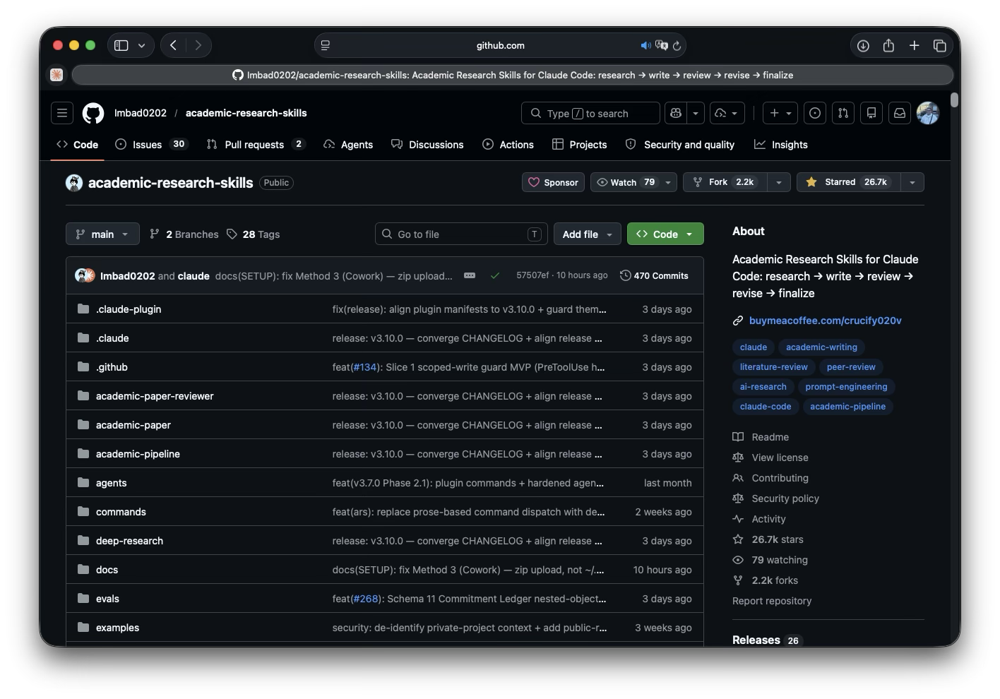
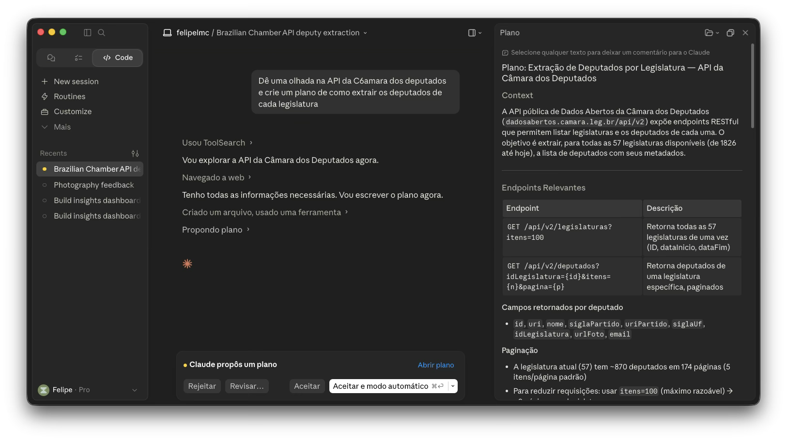

## {background-color="#1e293b"}

<br>

[01]{.agenda-num} &nbsp; **Recap**

<br>

[02]{.agenda-num} &nbsp; **Demo:** fichamento de literatura

<br>

[03]{.agenda-num} &nbsp; **Demo:** análise da Cota Parlamentar (CEAP)

<br>

[04]{.agenda-num} &nbsp; **Demo:** API da Câmara dos Deputados

<br>

[05]{.agenda-num} &nbsp; **Limites e ética**

---

# Recap {background-color="#2563eb"}

---

## O que vimos no Dia 1

- Claude Code age no seu ambiente: lê arquivos, executa código, acessa o git
- Instalação e integração ao VSCode, Positron e terminal
- **Pasta `.claude`**: CLAUDE.md, skills (`/voice`, `/summarize`, `/referee-2`), settings.json
- Skills encapsulam seu vocabulário — `/nome` chama qualquer uma delas

. . .

> Hoje vamos usar tudo isso para pesquisa de verdade

---

## Skills para pesquisa acadêmica

Repositório com skills prontas para download: [github.com/Imbad0202/academic-research-skills](https://github.com/Imbad0202/academic-research-skills)

{width="85%" fig-align="center"}

---

## Plan mode

Antes de executar qualquer tarefa não-trivial: entre em **plan mode** com `Shift+Tab`

{width="85%" fig-align="center"}

O agente apresenta o plano — você aprova, ajusta ou cancela antes de qualquer arquivo ser tocado

---

# Demo 1: fichamento de literatura {background-color="#2563eb"}

---

## O problema

Mapeamento de literatura é custoso: horas de leitura para identificar o que é relevante, o que conversa com o quê, o que ainda não foi feito

. . .

A **OpenAlex** indexa ~250 milhões de trabalhos acadêmicos com API gratuita e sem autenticação

. . .

Hoje: IA no setor público brasileiro — `"inteligência artificial" "setor público"` · idioma: pt · 2019–2025

---

## O pipeline

| Etapa | Ferramenta | Output |
|---|---|---|
| Busca | OpenAlex API | lista de papers + metadados |
| Filtragem | citações, ano, idioma | subset relevante |
| Download | PDFs em acesso aberto | arquivos locais |
| Sumarização | Claude Code | `autor_ano.md` por paper |
| Geração | metadados OpenAlex | `bibliography.bib` |

. . .

Para papers sem PDF disponível: Claude sumariza a partir do abstract

---

## A query

```python
import requests

params = {
    "search": '"inteligência artificial" "setor público"',
    "filter": "language:pt,publication_year:2019-2025",
    "sort": "cited_by_count:desc",
    "per_page": 25
}
resp = requests.get("https://api.openalex.org/works", params=params)
works = resp.json()["results"]
```

---

## Roteiro da demo ao vivo 🎬

1. Query OpenAlex → inspecionar os 50 papers retornados
2. Filtrar: manter os 20 mais citados com abstract disponível
3. Claude Code lê cada abstract e gera fichamento estruturado
4. Para papers com PDF: Claude expande o fichamento
5. Salvar em `/fichamentos/` + gerar `bibliography.bib`

. . .

> O CLAUDE.md do projeto vai estar no repositório — vocês acompanham no próprio computador

---

# Demo 2: análise da Cota Parlamentar {background-color="#2563eb"}

---

## O que é a Cota Parlamentar? 🏛️

A **CEAP** (Cota para o Exercício da Atividade Parlamentar) é a verba de gabinete dos deputados federais

- Cada deputado recebe até **~R$ 45 mil/mês** para despesas do mandato
- Categorias: passagens aéreas, alimentação, hospedagem, combustível, consultorias...
- **Todos os gastos são públicos** — Portal da Câmara disponibiliza os dados

. . .

Em 2023: mais de **R$ 220 milhões** em gastos totais

---

## Como baixar os dados 📥

Acesso direto no Portal da Câmara:

```
https://dadosabertos.camara.leg.br/swagger/api.html
```

Ou baixar o CSV diretamente:

```python
import pandas as pd

url = "https://www.camara.leg.br/cotas/Ano-2023.csv.zip"
df = pd.read_csv(url, sep=";", encoding="latin-1", compression="zip")
df.head()
```

---

## Roteiro da demo ao vivo 🎬

Com o Claude Code + dataset CEAP 2023:

1. Carregar e inspecionar os dados
2. Análise exploratória: distribuição de gastos, categorias mais comuns
3. Gastos por partido e por estado — padrões regionais
4. Identificar os maiores gastadores e as categorias mais polêmicas
5. Visualizações prontas para comunicar os achados

. . .

> Vocês acompanham no próprio computador — o CLAUDE.md do projeto vai estar no repositório

---

# Demo 3: API da Câmara dos Deputados {background-color="#2563eb"}

---

## APIs de dados abertos no Brasil 🇧🇷

| API | O que oferece |
|---|---|
| **Câmara dos Deputados** | Deputados, votações, proposições, despesas |
| **Portal da Transparência** | Gastos do governo federal, contratos, servidores |
| **IBGE** | PNAD, censo, indicadores socioeconômicos |
| **TSE** | Resultados eleitorais, candidatos, financiamento |

---

## API da Câmara dos Deputados

Base URL: `https://dadosabertos.camara.leg.br/api/v2`

```python
import requests

# Listar deputados da legislatura atual
resp = requests.get(
    "https://dadosabertos.camara.leg.br/api/v2/deputados",
    params={"idLegislatura": 57, "ordem": "ASC", "ordenarPor": "nome"}
)
deputados = resp.json()["dados"]
```

. . .

Retorna JSON bem estruturado — fácil de transformar em DataFrame com `pd.json_normalize()`

---

## Endpoints úteis

| Endpoint | O que traz |
|---|---|
| `/deputados` | Lista com partido, estado, foto |
| `/deputados/{id}/despesas` | Gastos individuais (mesmo que o CEAP) |
| `/votacoes` | Votações nominais na Câmara |
| `/votacoes/{id}/votos` | Como cada deputado votou |
| `/proposicoes` | PL, PEC, MP e outros |

---

## Roteiro da demo ao vivo 🎬

Conectando a API com o que já analisamos no CEAP:

1. Buscar a lista completa de deputados via API
2. Enriquecer o dataset CEAP com informações de partido e estado
3. Cruzar padrão de gastos com padrão de votação
4. Gerar visualização integrada

---

# Limites e ética {background-color="#2563eb"}

---

## Problemas parcialmente contornáveis 🔧

| Problema | Mitigação |
|---|---|
| Erros e alucinações | Revisão sistemática do output; rodar o código antes de confiar |
| Degradação do contexto | Sessões focadas por tarefa; CLAUDE.md com decisões-chave |
| Deriva de escopo | Instruções explícitas; revisão incremental |
| Reprodutibilidade | Documentar decisões — não só o código gerado |

---

## O que não delegar ⚠️

- A **interpretação substantiva** dos achados é do pesquisador
- As **decisões de design**: o que medir, como operacionalizar, quais hipóteses testar
- A **validação**: o agente sabe se o código roda; você verifica se o achado faz sentido
- A **responsabilidade autoral**: o pesquisador assina — inclusive pelo que o agente produziu

. . .

> O Claude Code é um acelerador, não um substituto do raciocínio científico

---

## Reprodutibilidade na pesquisa com IA

O código gerado pelo agente roda — mas o código sozinho não documenta **por que** você fez cada escolha

. . .

Boas práticas:

- Registrar no CLAUDE.md as decisões analíticas e suas justificativas
- Comentar no código as escolhas não óbvias
- Tratar o repositório como um diário de pesquisa, não só como um arquivo de scripts

---

## O que dizem os periódicos (internacionais)

Padrão dominante: **disclosure obrigatório** + IA não pode ser autora + responsabilidade é do pesquisador

<br>

- [AJPS](https://ajps.org/ajps-ai-policy/) — proíbe uso para redigir o manuscrito ou seções substanciais
- [APSR](https://www.cambridge.org/core/journals/american-political-science-review/information/author-instructions/preparing-your-materials) — disclosure obrigatório; alinhado à política Cambridge
- [Journal of Politics](https://www.journals.uchicago.edu/journals/jop/instruct) — proíbe uso na redação; revisores não podem usar IA para avaliar
- [Political Analysis](https://www.cambridge.org/core/journals/political-analysis/information/author-instructions/preparing-your-materials) — disclosure com ferramenta, versão, data e descrição do uso

---

## O que dizem os periódicos (brasileiros)

<br>

- [CNPq — Portaria nº 2.664/2026](https://www.gov.br/cnpq/pt-br/assuntos/noticias/cnpq-em-acao/cnpq-publica-portaria-que-institui-politica-de-integridade-na-atividade-cientifica) — disclosure obrigatório em todas as fases; IA não pode ser autora; pesquisador é integralmente responsável pelo conteúdo final
- [Opinião Pública / Unicamp](https://periodicos.sbu.unicamp.br/ojs/index.php/index/diretrizes) — nota de rodapé especificando ferramentas, fases e seções

---

# Para além do workshop {background-color="#2563eb"}

---

## Recursos úteis 📖

Documentação oficial: **claude.ai/code**

<br>

Seções recomendadas:

- *How Claude Code uses memory* — entender o CLAUDE.md em profundidade
- *Claude Code hooks* — automatizar ações recorrentes
- *Model Context Protocol (MCP)* — conectar a APIs e fontes externas

---

## Obrigado! {background-color="#1e293b"}

<div style="display:flex; align-items:center; gap:3em; margin-top:0.8em;">

<div style="flex:1;">
<div style="font-size:1.2em; font-weight:700; color:white; margin-bottom:0.25em;">Felipe Lamarca</div>
<div style="font-size:0.62em; color:#64748b; margin-bottom:1.4em; letter-spacing:0.02em;">IESP-UERJ · MAPE · DOXA · NECON</div>

<div style="font-size:0.65em; color:#94a3b8; line-height:2.4;">
📧 &nbsp;felipe.lamarca@hotmail.com<br>
🌐 &nbsp;felipelamarca.com
</div>

<div style="font-size:0.5em; color:#475569; margin-top:1.8em;">
📂 &nbsp;github.com/felipelmc/Presentations/tree/main/Intro-to-ClaudeCode-LABIIA-2026
</div>
</div>

<div style="display:flex; flex-direction:column; align-items:center; justify-content:center;">
<div style="background:white; display:inline-block; padding:16px; border-radius:16px; box-shadow:0 4px 24px rgba(0,0,0,0.4);">

</div>
<div style="font-size:0.52em; color:#64748b; margin-top:0.8em; letter-spacing:0.04em;">🔗 LinkedIn</div>
</div>

</div>
