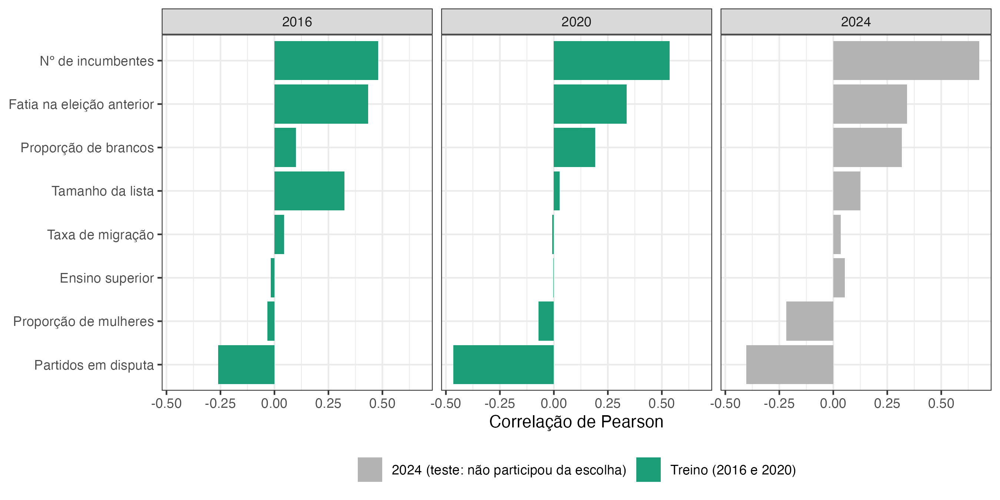
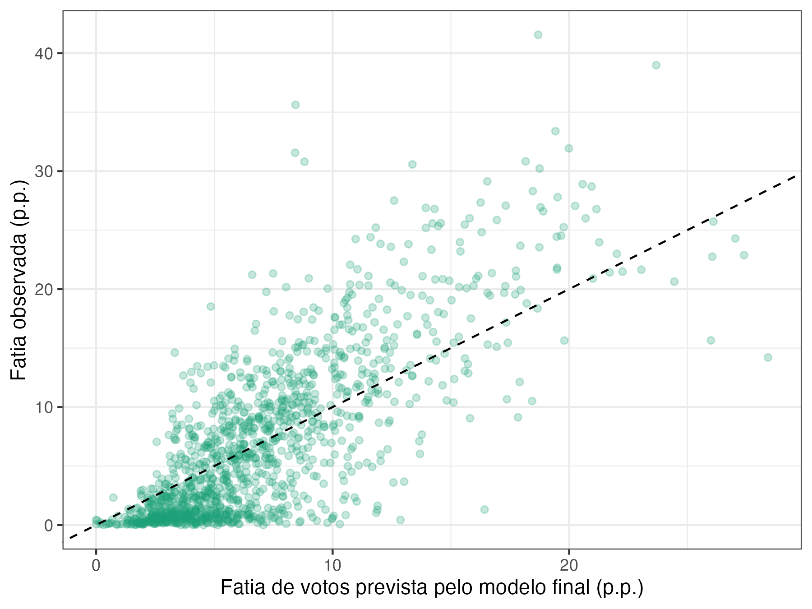
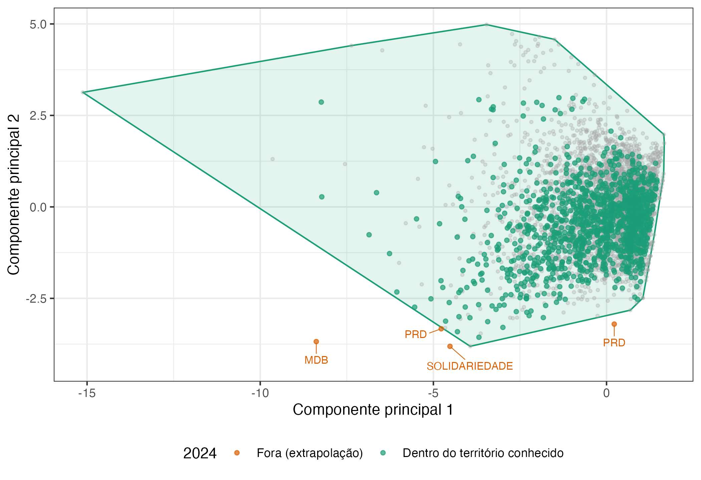
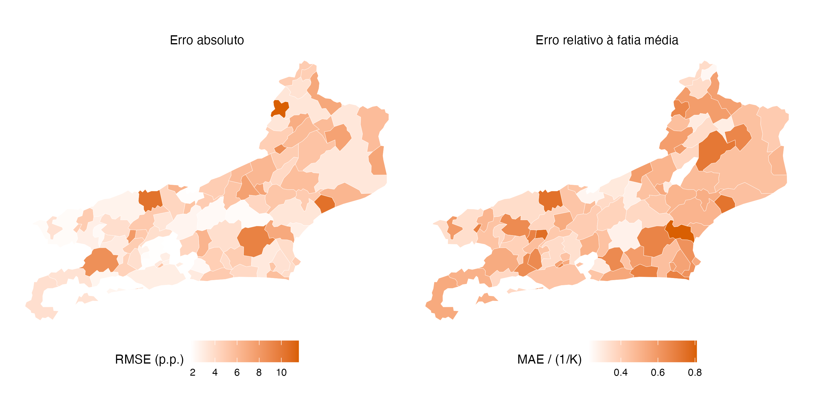

## Sumário

::: agenda
1. **Por que prever:** as duas perguntas
2. **Preparar:** dados, separação no tempo e vazamento
3. **Modelar:** benchmarks e modelos
4. **Resultados em 2024**
5. **Onde o modelo falha** e um passo além
6. **Cinco decisões**
:::

## Duas perguntas

:::: {.cards cols=2}
::: card
[Substantiva]{.rotulo}

É possível prever, com boa aproximação, o desempenho dos partidos nas eleições para vereador usando apenas informação disponível antes do pleito?
:::
::: {.card .destaque}
[Metodológica]{.rotulo}

Como se conduz, na prática, um exercício preditivo rigoroso, dos dados brutos à validação dos resultados?
:::
::::

Respondemos com um tutorial reprodutível: os 92 municípios fluminenses em três eleições para vereador (2016, 2020 e 2024).

::: notes
Na ciência política brasileira, a modelagem estatística serve quase só para explicar. A difusão do machine learning mostra que predição e explicação se complementam: a predição serve de benchmark para teorias, revela onde os modelos falham e disciplina o uso da informação disponível.
:::

## Descrever, explicar, prever

:::: {.cards cols=3}
::: card
[Descrever]{.rotulo}

Resumir padrões e regularidades, sem pretensão causal ou preditiva.
:::
::: card
[Explicar]{.rotulo}

Dizer por que uma variável afeta outra, com um modelo teórico e uma forma funcional interpretável.
:::
::: {.card .destaque}
[Prever]{.rotulo}

Antecipar casos ainda não observados. Pesa a informação disponível antes do evento.
:::
::::

Explicar e prever pedem procedimentos diferentes [@shmueli2010to], mas se complementam [@mullainathan2017; @hofman2021; @verhagen2022pragmatist].

::: {.bloco .claro}
O protocolo é o mesmo qualquer que seja o algoritmo: definir o alvo, separar treino e teste sem contaminação, comparar contra um benchmark e medir fora da amostra. Por isso o estimador aqui é o mais simples, a regressão linear.
:::

## Um tutorial em oito passos

:::: {.cards cols=3}
::: card
[Parte I · Preparar]{.rotulo}

1. O desfecho e a base
2. Treino, teste e validação
3. Vazamento de dados
4. Associações iniciais
:::
::: card
[Parte II · Modelar]{.rotulo}

5. Benchmarks e modelos
6. Ajuste
:::
::: card
[Parte III · Avaliar]{.rotulo}

7. Desempenho contra os benchmarks
8. Onde o modelo falha
:::
::::

Uma tarefa preditiva se define por quatro elementos: o alvo, o conjunto de informação (o que se sabe e quando), a função de perda e o critério de sucesso.

## Partido × município × ano {kicker="Passo 1 · O desfecho e a base"}

:::: numeros
::: {}
[4.785]{.valor} observações: 2.107 em 2016, 1.360 em 2020 e 1.318 em 2024
:::
::: {}
[92]{.valor} municípios do estado do Rio de Janeiro
:::
::: {}
[9]{.valor} variáveis, todas do TSE via Base dos Dados
:::
::::

- **Desfecho:** proporção de votos do partido na eleição para vereador.
- **2012** entra só como passado: para prever 2016 usamos 2012; para 2020, 2016; para 2024, 2020.
- **De-para de partidos:** fusões e mudanças de nome preservam o histórico. O desempenho anterior do UNIÃO em 2024 é a soma de DEM e PSL em 2020.

## Separar pelo tempo {kicker="Passo 2 · Treino, teste e validação"}

:::: {.cards cols=3}
::: card
[Aleatório]{.rotulo}

Sortear linhas (70/30, por convenção).
:::
::: card
[Por município]{.rotulo}

Sortear municípios inteiros: o modelo generaliza para lugares que nunca viu?
:::
::: {.card .destaque}
[Fora do tempo · adotado]{.rotulo}

Treinar no passado e prever a eleição seguinte: a situação real de uma previsão.
:::
::::

- **Treino:** 2016 e 2020 (3.467 linhas). **Teste:** 2024 (1.318 linhas), não observadas no ajuste.
- **Validação:** escolhas de forma funcional com treino em 2016 e validação em 2020.
- O erro é condicional ao partido lançar lista: 26,6% das combinações família-município de 2020 não disputam em 2024.

## O que sabemos antes da eleição {kicker="Passos 3 e 4 · Vazamento e associações"}

:::: {.columns .figura-texto}
::: {.column width="42%"}
- **Financiamento de campanha fica de fora:** a prestação de contas completa só sai depois da eleição.
- **Vazamento por seleção:** escolher preditores olhando o teste. Por isso 2024 aparece em cinza.
- **Vazamento por pré-processamento:** padronizar ou imputar na base inteira antes de separar.
:::
::: {.column width="58%"}

:::
::::

::: notes
O número de incumbentes na lista tem a maior associação com a proporção de votos, como na literatura sobre incumbência (Menezes 2010; Speck e Mancuso 2013). Também contam a votação anterior, o tamanho da lista, os partidos em disputa e a composição da lista.
:::

## Benchmarks antes de modelos {kicker="Passo 5 · Benchmarks e modelos"}

:::: columns
::: {.column width="48%"}
**Benchmarks**

- Média do desfecho no treino
- m0: repete a votação anterior
- Média histórica do partido
- Proporção de candidatos do partido no município
:::
::: {.column width="52%"}
**Modelos (regressão linear)**

- **m1:** votação anterior + nº de incumbentes na lista
- **m2:** m1 + tamanho da lista, partidos em disputa, proporção de brancos e de mulheres
:::
::::

::: {.bloco .claro}
Métricas em pontos percentuais: **MAE** (erro típico) e **RMSE** (penaliza erros grandes). O **R² fora da amostra** compara o modelo com a média do ano previsto e pode ser negativo.
:::

## Os modelos superam os benchmarks {kicker="Passo 7 · Desempenho em 2024"}

```{ojs}
//| echo: false
import {palette, plotStyle} from "/_extensions/felipelmc/plenario/ojs/notes.js"
pal = palette()
nomes = new Map([
  ["Fatia de candidatos", "Proporção de candidatos"],
  ["m0 (repete a anterior)", "m0 (repete a anterior)"]
])
ordem = ["Média do treino", "m0 (repete a anterior)", "Média histórica do partido",
         "Proporção de candidatos", "m1", "m2", "m1 fechado", "m2 fechado"]
regras = (await FileAttachment("dados/tbl_reguas.csv").csv({typed: true}))
  .map(d => ({...d, nome: nomes.get(d.Regra) ?? d.Regra,
              tipo: d.Regra.startsWith("m1") || d.Regra.startsWith("m2") ? "modelo" : "benchmark"}))
virgula = v => v.toFixed(2).replace(".", ",")
viewof metrica = Inputs.radio(["MAE", "RMSE"], {value: "MAE", label: "métrica (p.p.)"})
Plot.plot({
  style: plotStyle, width: 1150, height: 420, marginLeft: 330, marginRight: 80, marginBottom: 50,
  x: {domain: [0, 10], label: `${metrica} em 2024 (p.p.)`, labelAnchor: "center", labelOffset: 42, grid: true},
  y: {domain: ordem, label: null},
  color: {domain: ["benchmark", "modelo"], range: [pal.ink3, pal.accent]},
  marks: [
    Plot.ruleY(regras, {y: "nome", x1: d => d[`${metrica}_inf`], x2: d => d[`${metrica}_sup`],
                        stroke: "tipo", strokeWidth: 3, strokeOpacity: 0.35}),
    Plot.dot(regras, {y: "nome", x: metrica, fill: "tipo", r: 7}),
    Plot.text(regras, {y: "nome", x: d => d[`${metrica}_sup`], text: d => virgula(d[metrica]),
                       dx: 10, textAnchor: "start", fill: pal.ink2})
  ]
})
```

[Barras: intervalo de 95% por bootstrap dos 92 municípios. Fechado: as previsões de cada município são divididas pela soma, para somar 100%. O m2 fechado tem MAE 3,40, RMSE 4,51 e R² fora da amostra 0,58.]{.legenda-grafico}

::: notes
Repetir a votação anterior erra 5,53 p.p. e tem R² negativo. O melhor benchmark, a proporção de candidatos, erra 4,15 p.p. O m1 já o supera com dois preditores (3,75). Fechar as previsões no município é o maior ganho isolado.
:::

## Mais variáveis, pouco ganho fora da amostra {kicker="Passo 7 · Sobreajuste e replicação"}

:::: columns
::: {.column width="50%"}
| Modelo | Preditores | MAE no treino | MAE em 2024 |
|:-------|-----------:|--------------:|------------:|
| m1 | 2 | 3,38 | 3,75 |
| m2 | 6 | 2,94 | 3,68 |

: Erro dentro e fora do treino (p.p.)

O m2 ajusta o passado bem melhor, mas quase não melhora o futuro.
:::
::: {.column width="50%"}
| m2 fechado | MAE | RMSE | R² |
|:-----------|----:|-----:|---:|
| 2016 → 2020 | 3,39 | 4,50 | 0,573 |
| 2016 + 2020 → 2024 | 3,40 | 4,51 | 0,584 |

: As duas transições fora do tempo

A mesma receita entrega o mesmo desempenho nas duas janelas.
:::
::::

## Para a pergunta do título

:::: numeros
::: {}
[40 de 92]{.valor} municípios com o partido mais votado certo (m0: 13)
:::
::: {}
[0,73]{.valor} correlação de Spearman média dentro do município (m0: 0,33)
:::
::: {}
[78,5%]{.valor} das previsões a menos de 5 p.p. do observado
:::
::::

::: {.bloco .claro}
O modelo acerta bem a ordem e o nível dos partidos médios, e deve ser usado com desconfiança para os maiores.
:::

## Rio de Janeiro, 2024

:::: {.columns .figura-texto}
::: {.column width="62%"}
```{ojs}
//| echo: false
rio = (await FileAttachment("dados/tbl_rio_2024.csv").csv({typed: true}))
  .map(d => ({...d, erro: d.observado - d.previsto}))
destacados = new Set(["PSD", "PL", "PT", "UNIÃO", "PDT", "MDB", "PSOL"])
Plot.plot({
  style: plotStyle, width: 700, height: 470, marginLeft: 60, marginBottom: 55,
  x: {domain: [0, 27], label: "previsto (p.p.)", grid: true},
  y: {domain: [0, 27], label: "observado (p.p.)", grid: true},
  marks: [
    Plot.line([[0, 0], [27, 27]], {stroke: pal.ink3, strokeDasharray: "5,5"}),
    Plot.dot(rio, {x: "previsto", y: "observado", r: 7,
                   fill: d => Math.abs(d.erro) > 5 ? pal.danger : pal.accent, fillOpacity: 0.85}),
    Plot.text(rio.filter(d => destacados.has(d.sigla_partido)),
              {x: "previsto", y: "observado", text: "sigla_partido", dx: 12, textAnchor: "start", fill: pal.ink}),
    Plot.tip(rio, Plot.pointer({x: "previsto", y: "observado",
      title: d => `${d.sigla_partido}\nprevisto ${virgula(d.previsto)}\nobservado ${virgula(d.observado)}`}))
  ]
})
```
:::
::: {.column width="38%"}
- 28 partidos disputaram; as previsões somam 100%.
- **PSD** subestimado em 11,3 p.p. e **PL** em 7,5 p.p.
- REPUBLICANOS, PSOL, PODE, PP e SOLIDARIEDADE ficam a menos de um ponto.
:::
::::

::: notes
O retrato é bom no meio da tabela e ruim no topo. Votações muito altas dependem de fatores locais que a nominata não registra.
:::

## Calibração em 2024

:::: {.columns .figura-texto}
::: {.column width="55%"}

:::
::: {.column width="45%"}
A nuvem acompanha a diagonal até uns 10 p.p. e se achata acima disso.

O modelo comprime as previsões em direção à média.
:::
::::

## 2024 é território conhecido? {kicker="Passo 8 · Onde o modelo falha"}

:::: {.columns .figura-texto}
::: {.column width="55%"}

:::
::: {.column width="45%"}
- **99,7%** de 2024 cai dentro do contorno convexo.
- Benchmark sem deslocamento: metade retida do treino, **99,34%**; 2024, **99,33%**.
- Mas o nº de partidos em disputa cai **0,80 DP** entre treino e teste: o contorno não vê o centro.
- Fora ficam listas de MDB, PRD e SOLIDARIEDADE em câmaras de 5 a 8 partidos [@king2006].
:::
::::

## Onde o erro se concentra {kicker="Passo 8 · Onde o modelo falha"}

{.r-stretch}

Em termos relativos, o modelo é pior nas cidades grandes e competitivas. Por partido, 22 de 29 têm resíduo mediano negativo, e o resíduo acompanha o tamanho do partido (correlação de 0,92).

## Um passo além: modelos mais flexíveis

| Modelo (previsões fechadas) | MAE 2020 | MAE 2024 | RMSE 2024 | R² 2024 |
|:----------------------------|---------:|---------:|----------:|--------:|
| m2 fechado | 3,39 | 3,40 | 4,51 | 0,584 |
| m2 + efeito de partido | 3,38 | 3,30 | 4,39 | 0,606 |
| m2 + efeito de partido e de município | 3,35 | 3,14 | 4,23 | 0,634 |
| *Random forest* | 3,20 | 2,95 | 4,10 | 0,657 |

- **Multinível** [@gelman2006]: ganho real e modesto, com efeitos interpretáveis (PP +1,80; MDB +1,72; PT −1,32 p.p.).
- **Floresta aleatória:** menor erro, mas sem coeficientes; acerta o mais votado em 39 municípios, contra 40 do linear.
- O protocolo não muda quando o estimador muda.

## Cinco decisões

:::: columns
::: {.column width="55%"}
::: agenda
1. Definir o que se sabe e em que momento
2. Separar treino e teste como na situação real de uso
3. Montar benchmarks antes dos modelos
4. Medir fora da amostra
5. Verificar se o resultado sobrevive a outra janela
:::
:::
::: {.column width="45%"}
::: bloco
**Sim, dá para prever.** Seis preditores conhecidos antes da eleição e a restrição de soma 1: 3,4 p.p. de erro em 2024, o mesmo na transição de 2016 para 2020.
:::

Uma divisão proporcional ao tamanho das listas, sem parâmetros, erra 4,15 p.p. e supera a média histórica de cada legenda, que custa 36.
:::
::::

::: notes
O maior ganho isolado veio de impor ao modelo uma restrição que o problema já continha: as proporções de um município somam 1. Procurar a estrutura do próprio problema pagou mais do que sofisticar o estimador.
:::

## Referências {.scrollable}

::: {#refs}
:::

## Obrigado! {.encerramento}

:::: {.columns .encerramento-grade}
::: {.column width="50%"}
::: contato
[Felipe Lamarca]{.nome}

[IESP-UERJ]{.afiliacao}

[felipelamarca.com](https://felipelamarca.com)
:::
:::
::: {.column width="50%"}
::: contato
[Tomás Paixão Borges]{.nome}

[IESP-UERJ]{.afiliacao}

[tomaspborges.github.io](https://tomaspborges.github.io)
:::
:::
::::
